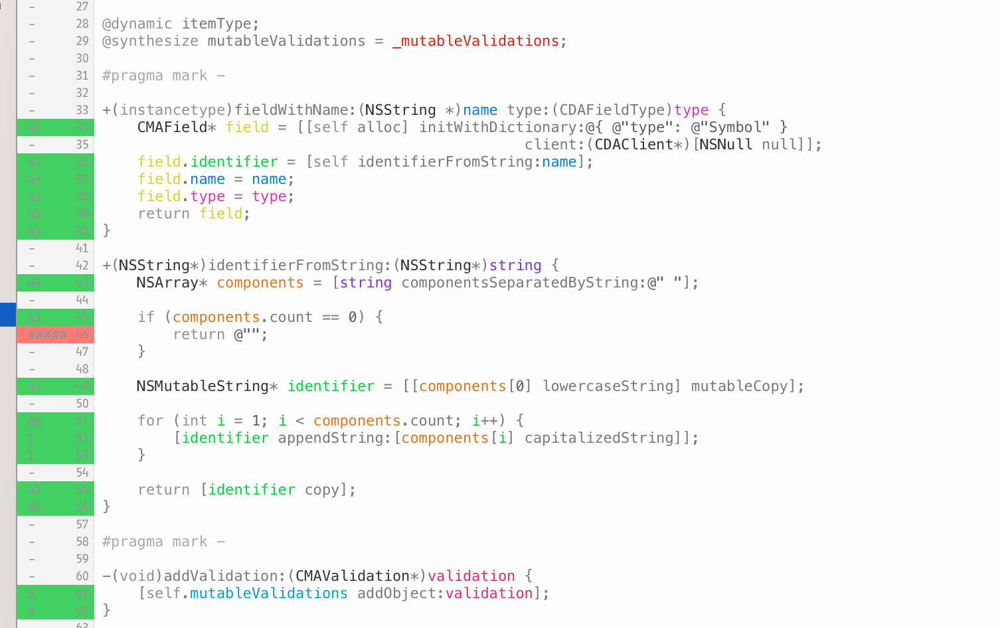

# Xcode plugin for displaying information in the gutter.



It will display JSON from *.gutter.json* in the current project's directory, example:

```json
{ "/some/file": [
  {
    "line": 23,
    "long_text": "Some longer text in a tooltip when hovering over the line.",
    "name": "main",
    "short_text": "gutter text",
    "background_color":"0x35CC4B"
  }
] }
```

see [this file](Resources/test.json) for more information. This enables the integration of abitrary tools and scripts into Xcode without the need to write yet another plugin.

## Current applications

- Show code coverage information, generated with [slather][5]. If you already have it up, slather can generate a suitable *.gutter.json* by simply running:

	$ slather coverage -g path/to/project.xcodeproj

- Show code size information of [Pebble][1] applications, using [puncover][2] - this also inspired the name of this plugin.

- Show findings of [Faux Pas][3], using [this script][4] to convert the JSON.

## Installation

Either

- Clone and build the plugin yourself, it will be installed to the right location automatically by building it.

or

- Install it via [Alcatraz](http://alcatraz.io/)

In any case, relaunch Xcode to load it.

## Help needed

Follow [@NeoNacho](https://twitter.com/NeoNacho) to help me beat [@orta](https://twitter.com/orta) in followers count.

[1]: https://getpebble.com
[2]: https://github.com/HBehrens/puncover
[3]: http://fauxpasapp.com
[4]: https://gist.github.com/neonichu/b172f0afe5ceb58155c3
[5]: https://github.com/venmo/slather
